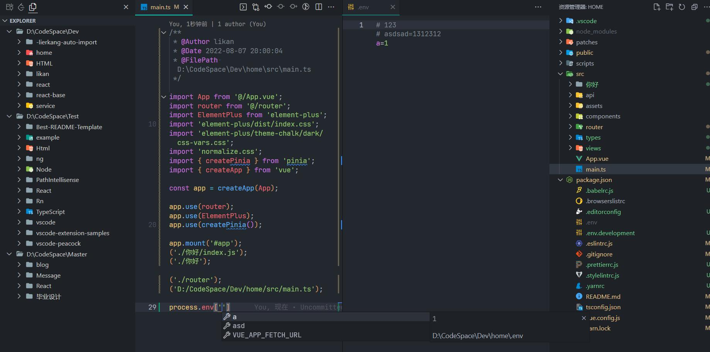
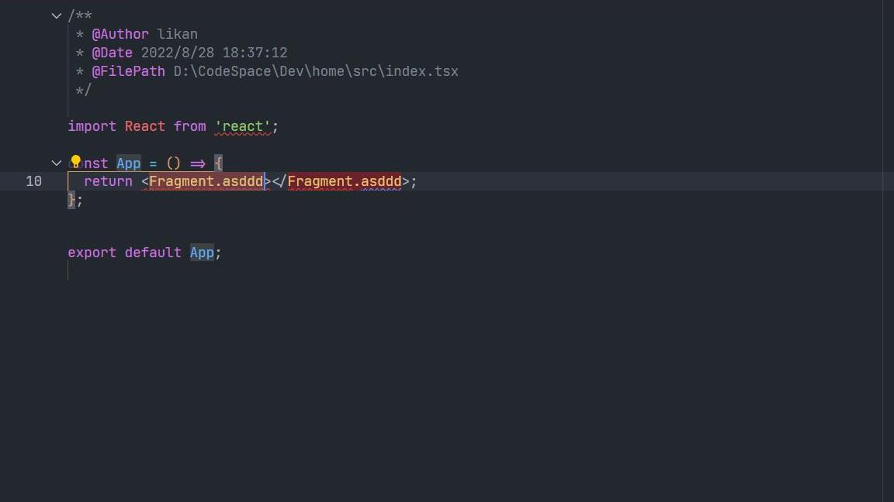

<br />
<div align="center">
  <a href="https://github.com/lirkang/likan">
    
  </a>

  <h3 align="center">Likan</h3>

  <p align="center">
    一个牛逼的插件!
    <br />
    An awesome vscode extension!
  </p>
</div>

## Features



<p align="center">process env</p>


<p align="center">
没有tsconfig.json的别名映射跳转<br />
jump without tsconfig.json
</p>



<p align="center">
链接标记(js, jsx, ts, tsx, vue) 和 创建文件时自动生成文件头文档注释<br />
linked editing(js, jsx, ts, tsx, vue) and doc comment
</p>

<div align="center">
  
</div>

<p align="center">
状态栏信息<br />
statusbar information
</p>

## Configuration

查询跳转时自动添加到后缀

File suffix automatically added when querying jumps.

- **default**:

```json
{
  "likan.language.exts": [".js", ".ts", ".jsx", ".tsx"]
}
```

查询跳转时别名映射

Query the alias mapping of jump files.

- **default**:

```json
{
  "likan.list.alias": {
    "@": "${root}/src",
    "~": "${root}"
  }
}
```

还有更多...

And more...

## License

Distributed under the MIT License. See `LICENSE` for more information.
